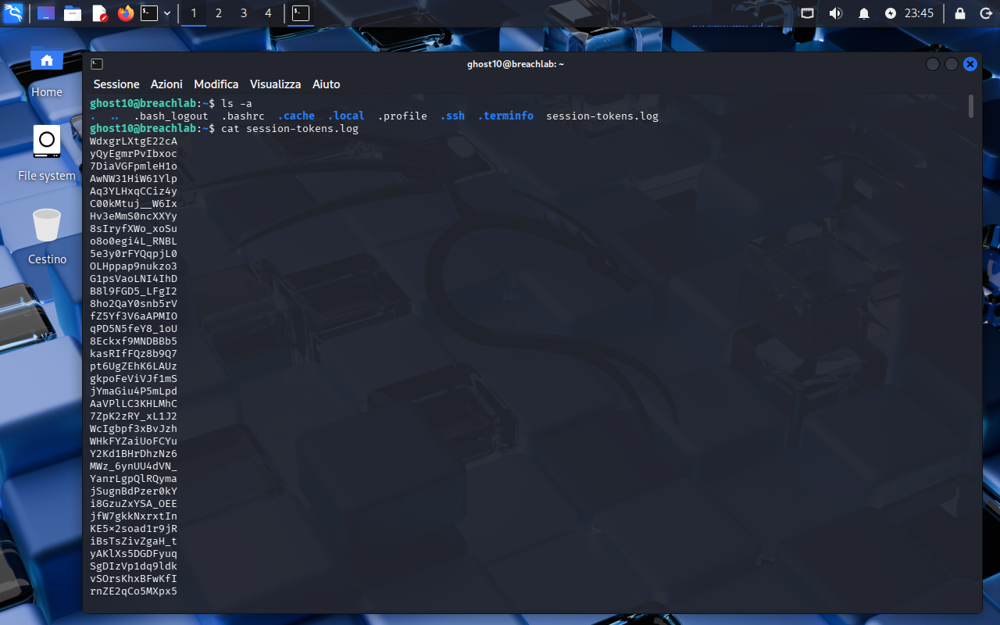
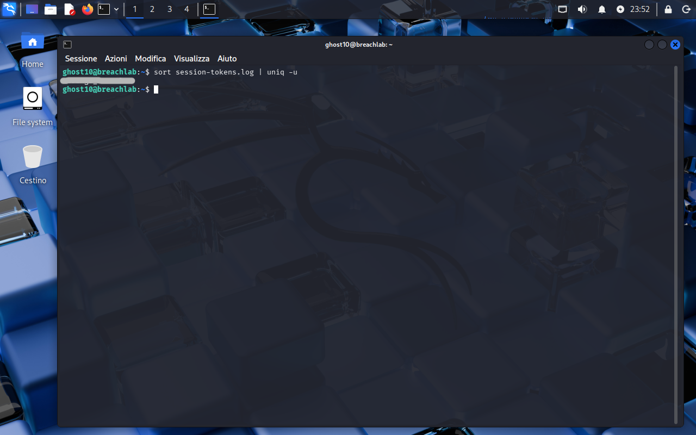

<!-- portfolio-desc: Every session token is paired except one, and only frequency gives it away -->

# Ghost Level 10 - Odd Token Out

## Objective

> A log full of session tokens, all the same shape, all indistinguishable by eye. One of them appears once while every other appears twice. The goal: isolate the unpaired one and pull the password for `ghost11`.

---

## Access

| Field | Value |
|---|---|
| Method | `ssh` |
| Host | `204.168.229.209:2222` |
| User | `ghost10` |

```bash
ssh ghost10@204.168.229.209 -p 2222
```

---

## Tools / concepts

- `sort`: brings identical lines next to each other, which is the precondition `uniq` needs
- `uniq -u`: prints only the lines that have no duplicate

---

## Solution

### Step 1: Look at what there is to work with

`ls -a` shows one file, `session-tokens.log`, and `cat` on it produces screen after screen of sixteen-character tokens, one per line. No timestamps, no labels, no prefixes, nothing to anchor a search on.

This is where Level 4's approach runs out. There the outlier gave itself away through content, since it used words no other line used. Here every line is the same alphabet and the same length, so nothing about a single line is suspicious in isolation. The only thing distinguishing the target is how many times it occurs.



### Step 2: Sort, and the structure appears

```bash
sort session-tokens.log
```

Sorted, the file's design is obvious: every token sits directly next to an identical twin. Confirming that pairing matters, because it is what makes the level's premise real rather than assumed.


### Step 3: Keep only what has no twin

```bash
sort session-tokens.log | uniq -u
```

`uniq` compares adjacent lines only, which is why the `sort` is load-bearing rather than cosmetic: run against the unsorted file it would find almost nothing, since the duplicates are scattered. `-u` then inverts the usual behaviour and prints the lines that occur exactly once. Exactly one line comes back.



### Step 4: Flag found

The password for `ghost11` is the single unpaired token in `~/session-tokens.log`.

---

## Notes

Two ways to arrive at the same place. `sort | uniq -u` answers "which line is alone" directly, while `sort | uniq -c | sort -n` gives the full frequency table and leaves the reading to you. The second is worth knowing for the case where the odd one out appears three times instead of once, which `-u` would silently skip.

The interesting part of the level is that it removes the usual handholds. Content-based searching cannot separate a token from its neighbours when every token is drawn from the same generator, and frequency is the only property left that the planted line does not share with the noise.
