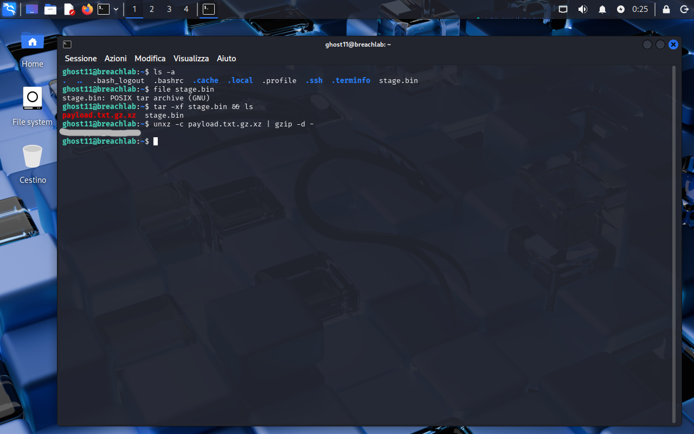

<!-- portfolio-desc: A .bin that is really a tar, wrapping two more compression layers -->

# Ghost Level 11 - Unwrap the Stage

## Objective

> A single `stage.bin` sits in the home directory, named to look like an opaque blob. It is neither opaque nor binary in the way the name suggests. The goal: unwrap every layer and pull the password for `ghost12`.

---

## Access

| Field | Value |
|---|---|
| Method | `ssh` |
| Host | `204.168.229.209:2222` |
| User | `ghost11` |

```bash
ssh ghost11@204.168.229.209 -p 2222
```

---

## Tools / concepts

- `file`: names a file by its content, not its extension
- `tar -xf`: extracts a tar archive
- `unxz -c` / `gzip -d -`: strip the xz and gzip layers, streaming through a pipe

---

## Solution

### Step 1: Ask what the file actually is

`ls -a` shows `stage.bin` next to the usual dotfiles. The `.bin` says "don't bother reading me", which is exactly why it earns a `file` first:

```
stage.bin: POSIX tar archive (GNU)
```

So the extension lies. There is no operator note to follow this time; the clue is the metadata itself. `tar -xf stage.bin` unpacks it, and `ls` shows what came out:

```
payload.txt.gz.xz   stage.bin
```

### Step 2: Read the extension chain as an order of operations

`payload.txt.gz.xz` is not just a long name, it is the build log. The layers were applied left to right, so `.xz` is the outermost wrapper and `.gz` sits under it. Unwrapping runs in reverse: xz off first, then gzip, then the `payload.txt` underneath.

```bash
unxz -c payload.txt.gz.xz | gzip -d -
```

`unxz -c` decompresses the xz layer to stdout instead of writing a file, the pipe hands that to `gzip -d -`, and the `-` tells gzip to read the stream rather than look for a file on disk. Both layers collapse in one line and the plaintext lands on screen.



### Step 3: Flag found

The password for `ghost12` is the decompressed contents of `payload.txt`, printed straight out of that pipe. `[REDACTED]`

---

## Notes

Same lesson as Level 7's `.dat`: the extension is a suggestion, and `file` settles the argument by looking at bytes. Here it goes one step further, because once the tar is open the remaining extensions stop being decoration and become instructions. `.gz.xz` tells you both what to run and in what order, no guessing required.

`unxz -c` and `xz -dc` are the same command, and the pipe could just as well be two `-d` calls chained. The point is recognizing that nested compression unwraps last-applied-first, which the filename spells out if you read it as a stack rather than a label.
