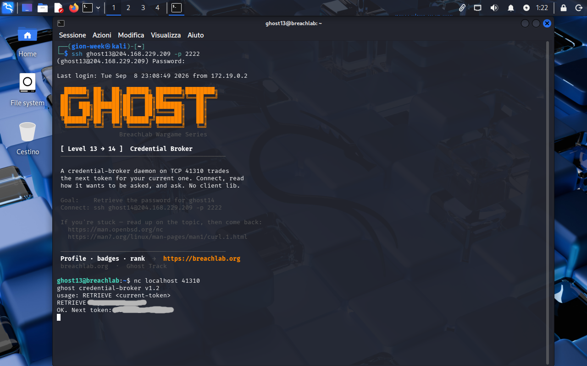

<!-- portfolio-desc: A daemon that publishes its own usage line and trades tokens over raw TCP -->

# Ghost Level 13 - Credential Broker

## Objective

> A credential-broker daemon listens on TCP 41310 and swaps the next token for the one you already hold. Nothing is hidden on disk and nothing needs decoding. The goal: speak the daemon's protocol correctly and pull the password for `ghost14`.

---

## Access

| Field | Value |
|---|---|
| Method | `ssh` |
| Host | `204.168.229.209:2222` |
| User | `ghost13` |

```bash
ssh ghost13@204.168.229.209 -p 2222
```

---

## Tools / concepts

- `nc`: opens a raw TCP session and keeps stdin attached, which is everything a line protocol needs
- service banners: a daemon that prints its own usage turns protocol discovery into reading

---

## Solution

### Step 1: Let the briefing do the recon

The login banner hands over the port and the method in one paragraph:

```
A credential-broker daemon on TCP 41310 trades
the next token for your current one. Connect, read
how it wants to be asked, and ask. No client lib.
```

No scanning needed this time, unlike Level 5 where the port had to be found first. The instruction worth taking seriously is `read how it wants to be asked`, which says the protocol documents itself and should not be guessed at. The hint links point at the `nc` and `curl` man pages, and since this is a raw line protocol rather than HTTP, `nc` is the one that fits.

### Step 2: Connect and read the grammar before sending anything

```bash
nc localhost 41310
```

The daemon greets first:

```
ghost credential-broker v1.2
usage: RETRIEVE <current-token>
```

One verb, one argument, spelled out. The `current-token` is not something to hunt for either: it is `ghost13`'s own password, already in hand because it opened this shell. Sending `RETRIEVE` followed by that token, matching the usage line literally, gets the trade:

```
OK. Next token: [REDACTED]
```



### Step 3: Flag found

The password for `ghost14` comes back on the broker's `OK. Next token:` line.

---

## Notes

Level 5 reached a listener with a one-shot `echo "GHOST" | nc`, and that reflex fails here. Piping a command in blind would push `RETRIEVE` at a socket before the usage line had been read, which works only if you already knew the verb. Staying interactive is what makes the banner useful.

The level hides no secret. The token you trade is the one you walked in with, so the entire difficulty is asking in the exact shape the daemon advertised. That is the realistic part: an undocumented internal service usually tells you how to talk to it the moment you connect, and the work is reading the response rather than reverse-engineering a format.
