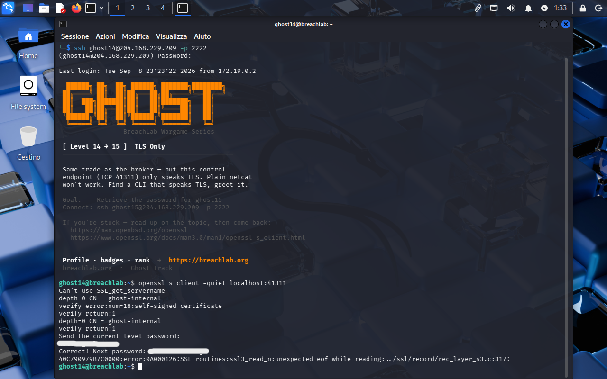

<!-- portfolio-desc: The same broker trade, moved behind TLS, where netcat stops being enough -->

# Ghost Level 14 - TLS Only

## Objective

> The same trade as the broker one level down, moved to TCP 41311 and wrapped in TLS. Netcat opens the socket and then stalls, because the server is waiting on a handshake it will never receive. The goal: greet the endpoint with a client that speaks TLS and pull the password for `ghost15`.

---

## Access

| Field | Value |
|---|---|
| Method | `ssh` |
| Host | `204.168.229.209:2222` |
| User | `ghost14` |

```bash
ssh ghost14@204.168.229.209 -p 2222
```

---

## Tools / concepts

- `openssl s_client`: completes a TLS handshake, then behaves like `nc` with stdin wired to the server
- `-quiet`: drops the certificate and session dump `s_client` prints by default
- self-signed certificates: verification fails, the transport works anyway

---

## Solution

### Step 1: The banner names the obstacle and the fix

```
Same trade as the broker — but this control
endpoint (TCP 41311) only speaks TLS. Plain netcat
won't work. Find a CLI that speaks TLS, greet it.
```

That settles the diagnosis before a single failed attempt. The application protocol has not changed from Level 13, only the transport underneath it, so the tool changes and the conversation does not. The hint links point at the `openssl` and `s_client` man pages.

### Step 2: Swap the client, ignore the certificate complaint

```bash
openssl s_client -quiet localhost:41311
```

`s_client` handles the handshake and then hands over an interactive session, stdin going out to the server and its output coming back. `-quiet` suppresses the session and certificate dump that would otherwise bury the prompt under a screen of PEM and cipher details.

The verify chain still prints, and it fails:

```
depth=0 CN = ghost-internal
verify error:num=18:self-signed certificate
verify return:1
```

Error 18 is a self-signed certificate, which is what an internal endpoint named `ghost-internal` was always going to present. `s_client` reports the failure and carries on rather than aborting, so the encrypted channel is up regardless. Distinguishing "this certificate has no trusted issuer" from "this connection did not work" matters here, because the first is noise and the second would end the level.

Then the service prompts, confirming it is the same broker logic in different clothes:

```
Send the current level password:
```

Sending `ghost14`'s own password gets the trade back:

```
Correct! Next password: [REDACTED]
```



### Step 3: Flag found

The password for `ghost15` comes back on the endpoint's `Correct! Next password:` line.

---

## Notes

The `ssl3_read_n:unexpected eof while reading` error that follows the answer reads like a failure and is not one. The server delivers the token and drops the connection without sending a TLS `close_notify`, so `s_client` reports the abrupt end. By that point the useful output has already arrived, and the noise belongs to the teardown.

Two levels, one protocol, and that is the whole lesson. `nc` and `s_client` are interchangeable from stdin's point of view, so putting a service behind TLS changes which binary you reach for and nothing about what you say to it. The verify error is the other half: certificate validation and channel encryption are separate questions, and a self-signed cert answers the first badly while leaving the second intact.
