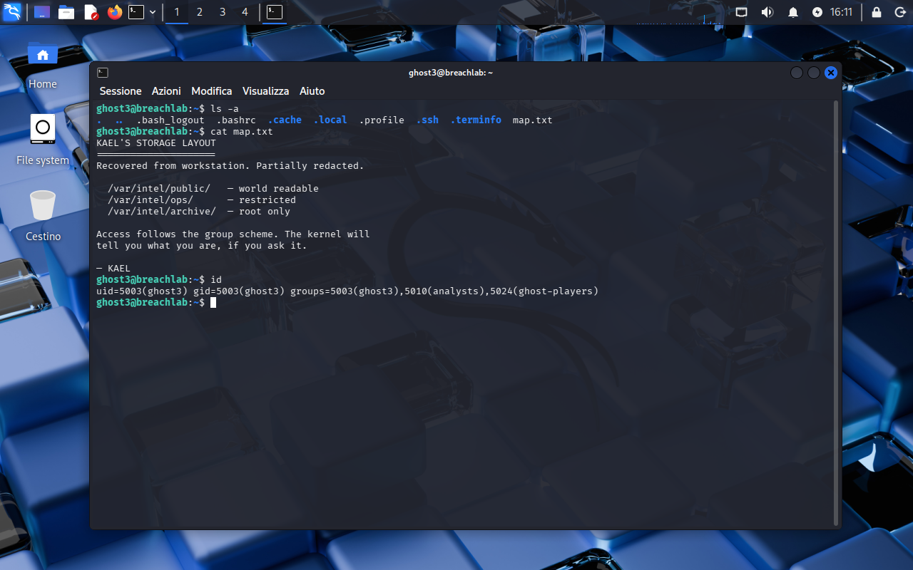
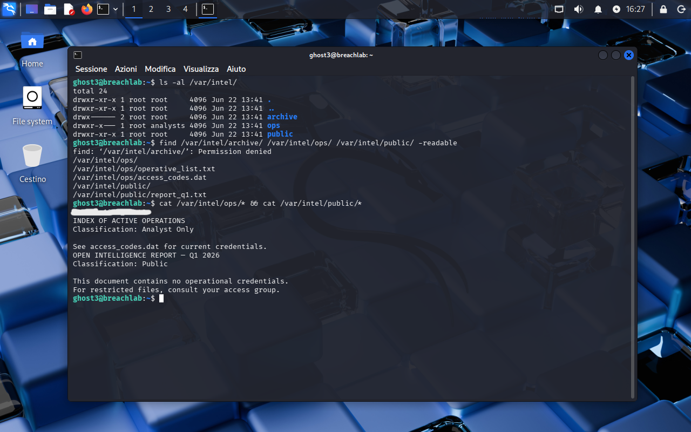

<!-- portfolio-desc: KAEL's storage map, and letting `id` say which tier of /var/intel you're actually in -->

# Ghost Level 3 - Access Denied

## Objective

> KAEL's recovered storage map splits `/var/intel/` into three tiers of access and hints that the way to know which ones are yours is to ask the kernel directly. The goal: work out what `ghost3` can actually reach, and pull the password for `ghost4`.

---

## Access

| Field | Value |
|---|---|
| Method | `ssh` |
| Host | `204.168.229.209:2222` |
| User | `ghost3` |

```bash
ssh ghost3@204.168.229.209 -p 2222
```

---

## Tools / concepts

- `id`: prints your uid, gid, and every group you belong to
- `ls -al`: directory permissions and ownership at a glance
- `find -readable`: filters a file list down to what you can actually open
- group permissions: the middle `rwx` triplet, and why group membership can grant access even without ownership

---

## Solution

### Step 1: Read the map, then ask the kernel what you are

`ls -a` in the home directory shows the usual dotfiles plus `map.txt`:

```
KAEL'S STORAGE LAYOUT
━━━━━━━━━━━━━━━━━━━━━━━━━━━━━

Recovered from workstation. Partially redacted.

  /var/intel/public/    — world readable
  /var/intel/ops/       — restricted
  /var/intel/archive/   — root only

Access follows the group scheme. The kernel will
tell you what you are, if you ask it.

— KAEL
```

KAEL lists three tiers but doesn't say which one `ghost3` lands in. The note's last line is the actual instruction: ask the kernel. `id` answers it directly:

```
uid=5003(ghost3) gid=5003(ghost3) groups=5003(ghost3),5010(analysts),5024(ghost-players)
```

`ghost3` belongs to `analysts`, which is exactly the kind of group name map.txt's "restricted" tier implies.



### Step 2: Confirm it with real permissions, then read what that membership unlocks

`ls -al /var/intel/` shows the actual bits behind KAEL's three tiers:

```
drwx------ 2 root root     4096 Jun 22 13:41 archive
drwxr-x--- 1 root analysts 4096 Jun 22 13:41 ops
drwxr-xr-x 1 root root     4096 Jun 22 13:41 public
```

`archive/` really is root-only, no group or other bits at all. `ops/` is owned by group `analysts` with group read+execute, the exact group `id` just placed `ghost3` in. `public/` is world-readable, as advertised.

`find /var/intel/archive/ /var/intel/ops/ /var/intel/public/ -readable` checks the theory against reality instead of eyeballing rwx bits: it reports "Permission denied" on `archive/`, and lists `ops/` and `public/` along with what's inside them (`operative_list.txt`, `access_codes.dat`, `report_q1.txt`).

Reading everything reachable in one line, `cat /var/intel/ops/* && cat /var/intel/public/*`: `access_codes.dat` comes first alphabetically and is the actual credentials file. `operative_list.txt` is just an index pointing back at it ("See access_codes.dat for current credentials"). `report_q1.txt` in `public/` is a dead end that says so itself: "This document contains no operational credentials. For restricted files, consult your access group."



### Step 3: Flag found

The password for `ghost4` is in `/var/intel/ops/access_codes.dat`, reachable only because `ghost3` sits in the `analysts` group.

---

## Notes

First level where the planted clue isn't a file that hands over the next step outright, it's a structural hint (map.txt) that only pays off once it's checked against a system fact (`id`, then `ls -al`). Worth remembering that Unix permissions aren't just owner-vs-everyone: the group triplet is a real access tier on its own, and `find -readable` is a faster way to confirm what's actually open to you than reading rwx bits by hand.
