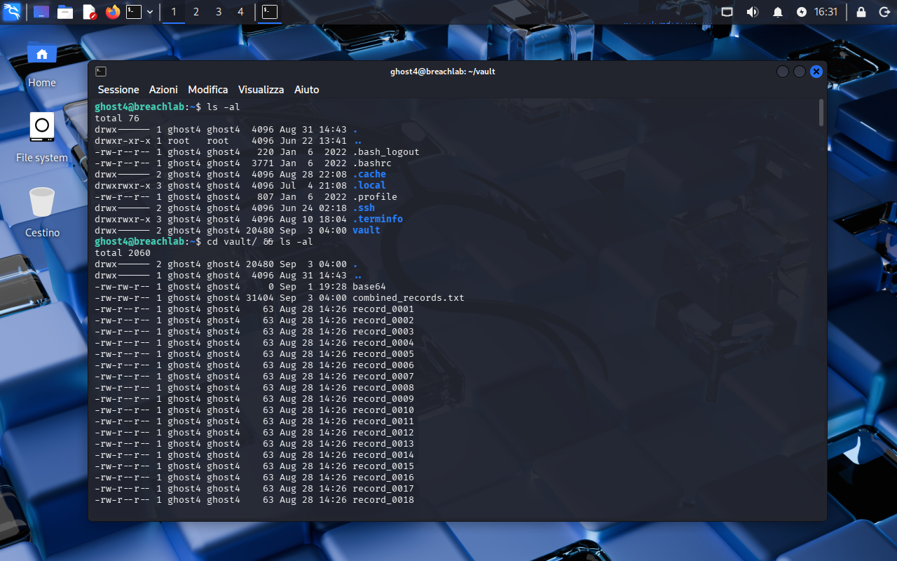
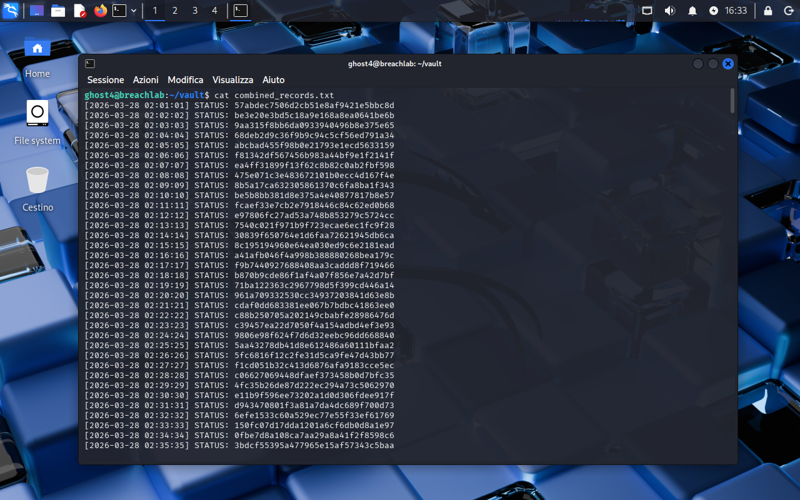
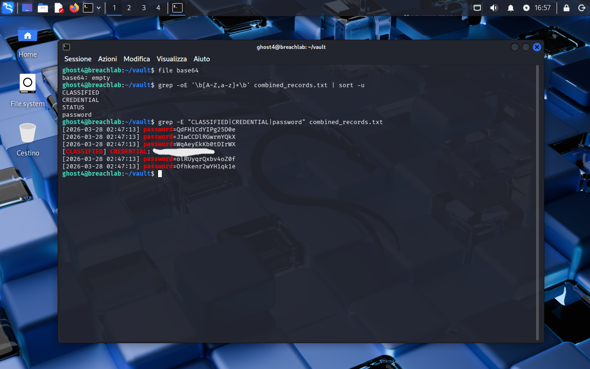

<!-- portfolio-desc: One classified line buried in a few hundred identical status records -->

# Ghost Level 4 - Signal in the Noise

## Objective

> The vault is full of status records that all look alike, and one line in there isn't a status record at all. The goal: find the line that breaks the pattern and pull the password for `ghost5`.

---

## Access

| Field | Value |
|---|---|
| Method | `ssh` |
| Host | `204.168.229.209:2222` |
| User | `ghost4` |
| Password | `[REDACTED]` (found in Level 3) |

```bash
ssh ghost4@204.168.229.209 -p 2222
```

---

## Tools / concepts

- `file`: says what something actually is before you spend time on it
- `grep -oE` piped to `sort -u`: lists every distinct token in a file instead of every line
- `grep -E` alternation: pulls the outlier lines once you know which words to ask for

---

## Solution

### Step 1: Size up the vault

`ls -al` in the home directory shows one thing worth opening, `vault`. Inside, another `ls -al` turns up several hundred `record_XXXX` files at 63 bytes each, a 31 KB `combined_records.txt`, and a file named `base64` sitting at 0 bytes.



### Step 2: Look at the noise, then stop reading it

`cat combined_records.txt` scrolls past line after line of the same shape:

```
[2026-03-28 02:01:01] STATUS: 57abdec7506d2cb51e8af9421e5bbc8d
[2026-03-28 02:02:02] STATUS: be3e20e3bd5c18a9e168a8ea0641be6b
```

Timestamp, `STATUS:`, 32 hex characters, several hundred times over. Scanning that by eye for the one line that differs is exactly the trap the level is built on.



### Step 3: Ask which words exist, not which lines

The 0-byte file first: `file base64` answers `base64: empty`. It is named after a command purely to suggest a decoding step that does not exist.

Every record is hex plus one repeated keyword, so the cheap move is to extract the alphabetic tokens and dedupe them:

```bash
grep -oE '\b[A-Z,a-z]+\b' combined_records.txt | sort -u
```

```
CLASSIFIED
CREDENTIAL
STATUS
password
```

Four words in the entire file. `STATUS` is the noise, and the other three only exist because something in there is not a status line. Asking for those lines directly:

```bash
grep -E "CLASSIFIED|CREDENTIAL|password" combined_records.txt
```

That returns six lines: five decoys shaped like `password=<16 random characters>`, all sharing one identical timestamp, and a single line in a different format, `[CLASSIFIED] CREDENTIAL:`, which is the real one.



### Step 4: Flag found

The password for `ghost5` sits on the lone `[CLASSIFIED] CREDENTIAL:` line inside `~/vault/combined_records.txt`.

---

## Notes

The planted material runs in reverse this time. There is no KAEL note pointing the way: instead the vault ships an empty file named `base64`, whose only job is to imply a decoding step, and five fake `password=` lines to catch anyone whose grep stops at the first keyword that comes to mind. Deriving the file's vocabulary before searching it flips the problem around, turning "find something suspicious in a few hundred lines" into a four-word list where the outliers name themselves.
