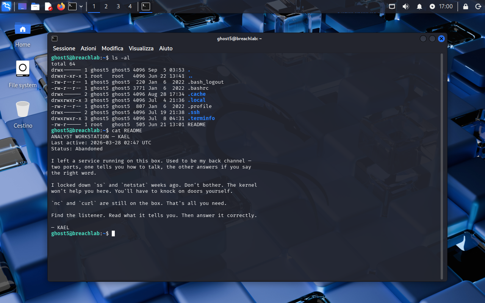
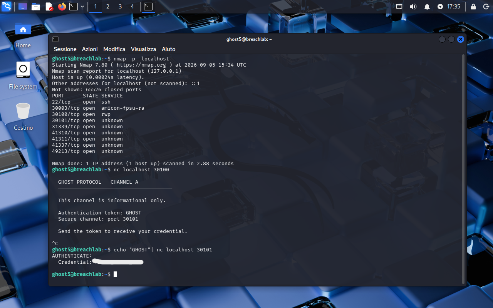

<!-- portfolio-desc: KAEL's two-port back channel, one side talking and the other answering -->

# Ghost Level 5 - The Listener

## Objective

> KAEL left a service running on the box as a back channel: two ports, one that explains how to talk and one that answers if you say the right word. `ss` and `netstat` are gone. The goal: find the listener, read what it tells you, answer it correctly, and pull the password for `ghost6`.

---

## Access

| Field | Value |
|---|---|
| Method | `ssh` |
| Host | `204.168.229.209:2222` |
| User | `ghost5` |

```bash
ssh ghost5@204.168.229.209 -p 2222
```

---

## Tools / concepts

- `nmap -p-`: sweeps all 65535 TCP ports in one pass
- `nc`: speaks raw TCP, both for reading a banner and for sending a line
- `echo "..." | nc host port`: sends exactly one line and prints the reply, no interactive session needed

---

## Solution

### Step 1: Read the brief

`ls -al` shows a single `README`, owned by root and readable through the `ghost5` group. `cat README`:

```
ANALYST WORKSTATION — KAEL
Last active: 2026-03-28 02:47 UTC
Status: Abandoned

I left a service running on this box. Used to be my back channel —
two ports, one tells you how to talk, the other answers if you say
the right word.

I locked down `ss` and `netstat` weeks ago. Don't bother. The kernel
won't help you here. You'll have to knock on doors yourself.

`nc` and `curl` are still on the box. That's all you need.

Find the listener. Read what it tells you. Then answer it correctly.

— KAEL
```

That is an unusually precise brief: it gives the shape of the service (two ports, one informational, one challenge-response), the tools that still work, and the fact that the usual socket-listing commands were removed on purpose.



### Step 2: Find the listener

`ss` and `netstat` are locked down, but `nmap` turned out to still be installed, which beats knocking port by port:

```bash
nmap -p- localhost
```

```
PORT      STATE SERVICE
22/tcp    open  ssh
30003/tcp open  amicon-fpsu-ra
30100/tcp open  rwp
30101/tcp open  unknown
31339/tcp open  unknown
41310/tcp open  unknown
41311/tcp open  unknown
41337/tcp open  unknown
49213/tcp open  unknown
```

Nine open ports, not the two the README promised. Port 22 is the sshd that let us in, and the rest are decoys picked to look inviting (31339 and 41337 sit one digit off the numbers anyone would try first). The README's "two ports" is what makes the list tractable: the candidates are the adjacent pairs, and `nc localhost 30100` answers on the first try.

### Step 3: Talk to one port, answer on the other

```bash
nc localhost 30100
```

```
  GHOST PROTOCOL — CHANNEL A
  ─────────────────────────

  This channel is informational only.

  Authentication token: GHOST
  Secure channel: port 30101

  Send the token to receive your credential.
```

Channel A does exactly what KAEL said it would: it hands over the token and names the port that accepts it. The connection stays open after printing, so it needs a Ctrl-C to get the prompt back.

The second port wants that token as a single line, which is a one-liner rather than an interactive session:

```bash
echo "GHOST" | nc localhost 30101
```

It replies with `AUTHENTICATE:` and the credential.



### Step 4: Flag found

The password for `ghost6` comes back from port 30101 in response to the token published by Channel A on port 30100.

---

## Notes

KAEL's note carries more operational detail than in the earlier levels, and it is what keeps nine open ports from turning into a guessing game: knowing the service is a pair, one side informational and one side challenge-response, is enough to skip most of the list.

Worth flagging the shortcut taken here. KAEL points at `nc` and `curl` because he pulled `ss` and `netstat`, but nobody removed `nmap`, so the sweep took one command instead of a manual knock. The intended path still works: netcat scans a range on its own with `nc -zv localhost 30000-42000` before connecting to whatever answers.
