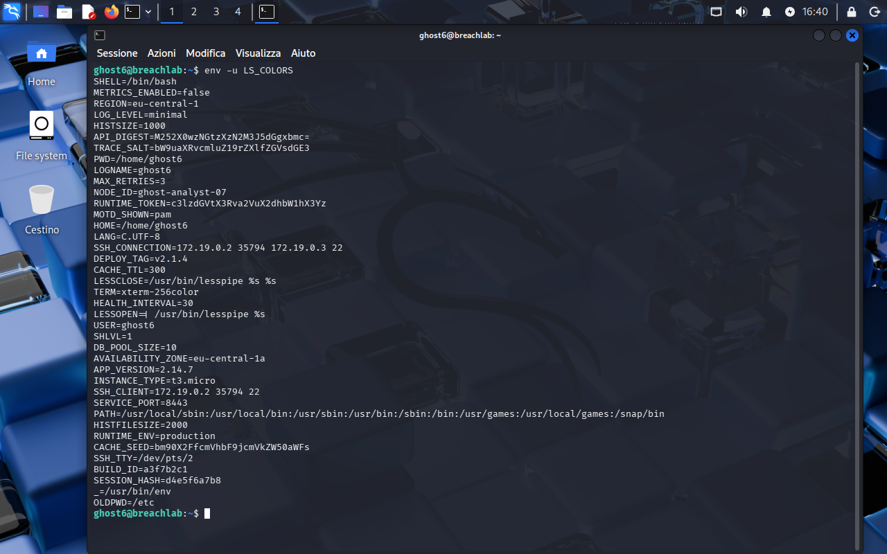
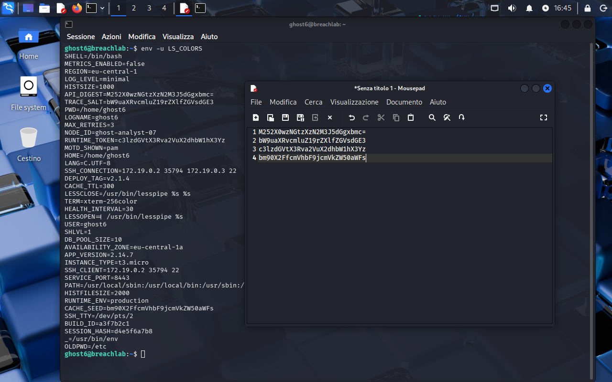
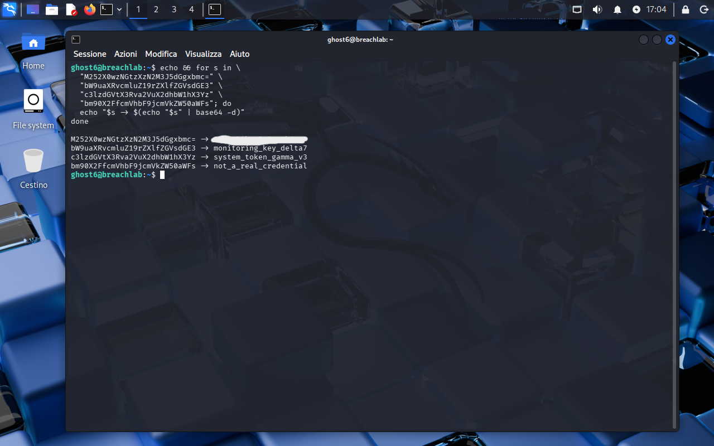

<!-- portfolio-desc: Four base64 blobs in the environment, three of them decoys -->

# Ghost Level 6 - Ghost in the Machine

## Objective

> The credential never touches the filesystem this time. It rides in the process environment, encoded, next to a pile of variables built to look like ordinary cloud plumbing. The goal: pick the right one and pull the password for `ghost7`.

---

## Access

| Field | Value |
|---|---|
| Method | `ssh` |
| Host | `204.168.229.209:2222` |
| User | `ghost6` |

```bash
ssh ghost6@204.168.229.209 -p 2222
```

---

## Tools / concepts

- `env`: dumps the environment, with `-u VAR` to drop one that would otherwise flood the output
- `base64 -d`: decodes a candidate
- a `for` loop: decodes every candidate in one pass instead of four separate commands

---

## Solution

### Step 1: Dump the environment and find the candidates

```bash
env -u LS_COLORS
```

The `-u LS_COLORS` is housekeeping: that variable alone would take most of the screen and none of it matters here. What is left is a convincing amount of dressing, `REGION`, `AVAILABILITY_ZONE`, `INSTANCE_TYPE`, `DEPLOY_TAG`, `BUILD_ID`, `DB_POOL_SIZE`, all shaped like a real deployment.

Four values do not fit that pattern. `API_DIGEST`, `TRACE_SALT`, `RUNTIME_TOKEN` and `CACHE_SEED` are alphanumeric blobs in the base64 alphabet, one of them carrying `=` padding. Everything else in the dump is a word, a number, or a path.



### Step 2: Collect them

The four blobs went into a scratch editor rather than being retyped by hand, which is worth the extra window when a single wrong character produces a decode error that looks like a wrong answer.



### Step 3: Decode all four at once

Four `base64 -d` invocations would work, but a loop keeps the value next to its result, which is the part that matters when three of the four are lies:

```bash
for s in "$API_DIGEST" "$TRACE_SALT" "$RUNTIME_TOKEN" "$CACHE_SEED"; do
  echo "$s → $(echo "$s" | base64 -d)"
done
```

The run in the screenshot pastes the four literal values in instead of referencing the variables, which is the same thing with more typing.

Three of them come back self-labelled:

```
monitoring_key_delta7
system_token_gamma_v3
not_a_real_credential
```

`TRACE_SALT` and `RUNTIME_TOKEN` decode to strings that read like infrastructure keys and are not, and `CACHE_SEED` gives up the game outright. The fourth is the real one.



### Step 4: Flag found

The password for `ghost7` is the decoded value of `API_DIGEST`, held in the environment rather than in any file.

---

## Notes

No note from KAEL here. The environment itself is the planted material: the fake variables are specific enough to pass as a real deployment, and the decoys decode into things that sound like credentials so a hasty read stops at the first plausible hit. Decoding all four before judging any of them costs one loop and removes the guesswork entirely.

Environment variables are worth remembering as a hiding place on their own. They leave no file to find, they are inherited by every child process, and anything that can read the process can read them.
