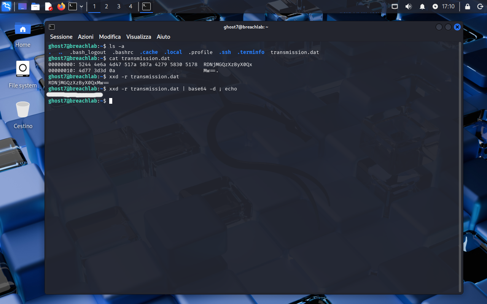

<!-- portfolio-desc: A .dat file that is really a hex dump wrapped around base64 -->

# Ghost Level 7 - Lost in Translation

## Objective

> One file sits in the home directory, named like binary and encoded twice over. The goal: peel both layers and pull the password for `ghost8`.

---

## Access

| Field | Value |
|---|---|
| Method | `ssh` |
| Host | `204.168.229.209:2222` |
| User | `ghost7` |

```bash
ssh ghost7@204.168.229.209 -p 2222
```

---

## Tools / concepts

- `cat`: enough to tell a real binary from a text file wearing a `.dat` extension
- `xxd -r`: reverses a hex dump back into the bytes it describes
- `base64 -d`: the second layer

---

## Solution

### Step 1: Look at the file before deciding what it is

`ls -a` turns up `transmission.dat` next to the usual dotfiles. The extension suggests binary, so the reflex is to reach for a hex viewer, but `cat transmission.dat` prints cleanly: two lines of offsets, hex columns and an ASCII column. The file does not contain binary data, it contains the text of a hex dump.

The ASCII column on the right is the giveaway. It already spells out a base64 string, padding included, so the second layer is identifiable before anything gets decoded.

### Step 2: Reverse the dump, then decode

`xxd -r` runs a hex dump backwards, turning the printed offsets and hex pairs back into the bytes they stand for:

```bash
xxd -r transmission.dat
```

That returns the base64 payload on its own, confirming the ASCII column was not a coincidence. Both layers then collapse into one pipe:

```bash
xxd -r transmission.dat | base64 -d ; echo
```

The trailing `echo` only adds the newline the decoded output does not carry, so the credential does not end up glued to the next prompt.



### Step 3: Flag found

The password for `ghost8` comes out of that pipe, from `~/transmission.dat`.

---

## Notes

The whole level rests on not trusting the extension. `.dat` invites you to treat the file as opaque and start guessing at formats, when `cat` answers the question in one command: it is text, and the text describes bytes.

Reading the dump's ASCII column before reversing it is the other half. A hex dump carries its own preview, so the encoding of the next layer is visible up front rather than something to discover by trial.
