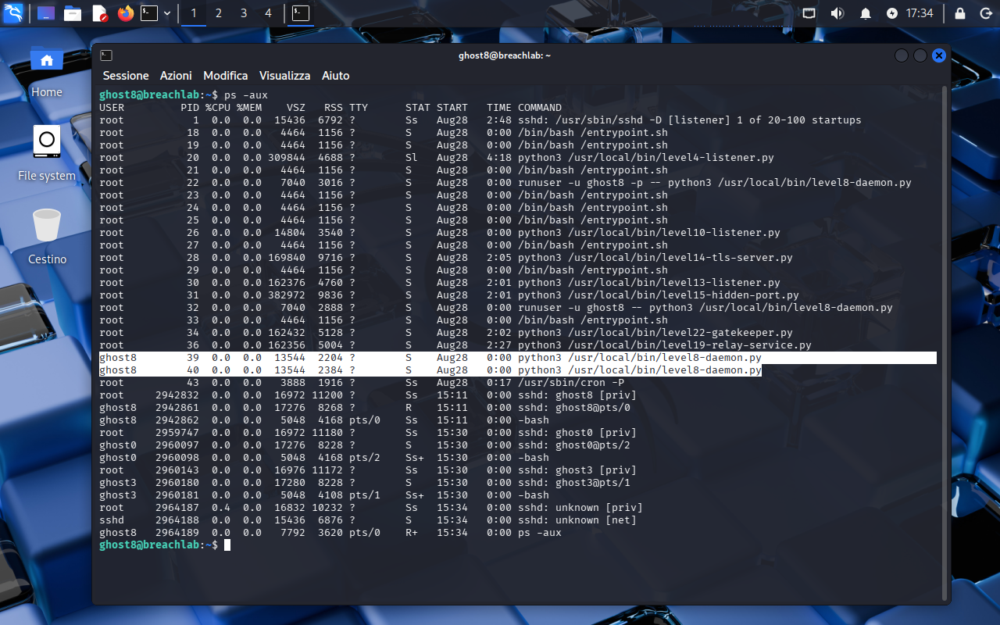
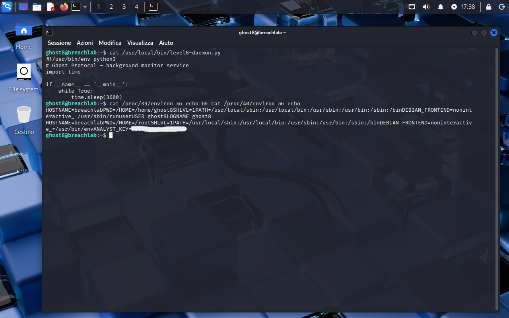
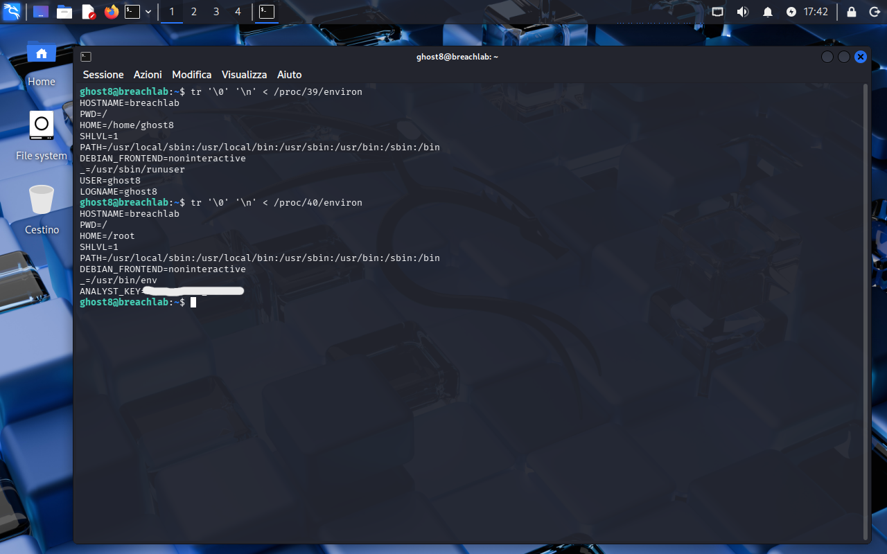

<!-- portfolio-desc: A daemon that drops to ghost8 but keeps root's environment -->

# Ghost Level 8 - Something's Running

## Objective

> A background service runs on the box under this account. Its code holds nothing, but the environment it was started with does. The goal: read that environment and pull the password for `ghost9`.

---

## Access

| Field | Value |
|---|---|
| Method | `ssh` |
| Host | `204.168.229.209:2222` |
| User | `ghost8` |

```bash
ssh ghost8@204.168.229.209 -p 2222
```

---

## Tools / concepts

- `ps aux`: the full process table, including who owns what
- `/proc/<pid>/environ`: a process's environment, readable when you own the process
- `tr '\0' '\n'`: turns the NUL-separated contents of `environ` into lines

---

## Solution

### Step 1: Find what is running as you

```bash
ps -aux
```

The table is busy, because this host runs the daemons for most of the track at once (listeners for later levels, a TLS server, a relay). The rows that matter are the two owned by `ghost8`, both running the same thing:

```
python3 /usr/local/bin/level8-daemon.py
```

Further up, root's invocation shows how they got there:

```
runuser -u ghost8 -p -- python3 /usr/local/bin/level8-daemon.py
```

`runuser -u ghost8` drops to this account, and `-p` preserves the environment across the drop. That flag is the level.



### Step 2: Rule out the code, then read the environment

`cat /usr/local/bin/level8-daemon.py` is a dead end by design: a shebang, a comment, and a `while True: time.sleep(3600)` loop. Nothing is stored, nothing is printed.

The process is owned by `ghost8`, so its `/proc/<pid>/environ` is readable without any privilege escalation. Reading it with `cat` works but is unpleasant, because `environ` separates entries with NUL bytes and the terminal renders the whole thing as one run-on blob.



### Step 3: Split it into lines

```bash
tr '\0' '\n' < /proc/<pid>/environ
```

One line per variable, and the difference between the two processes is immediate. The first carries the post-drop environment:

```
HOME=/home/ghost8
_=/usr/sbin/runuser
USER=ghost8
LOGNAME=ghost8
```

The second still holds root's:

```
HOME=/root
_=/usr/bin/env
ANALYST_KEY=[REDACTED]
```

Same binary, same owner, different environment, because `-p` handed root's copy through to one of them.



### Step 4: Flag found

The password for `ghost9` is the value of `ANALYST_KEY`, in the `environ` of the daemon process that kept root's environment. PIDs are assigned per boot, so the numbers in the screenshots are not worth copying: find the pair in `ps` first.

---

## Notes

The bug being demonstrated is `runuser -p`, not `/proc`. Dropping privileges while preserving the environment leaves anything root had exported sitting in a process that an unprivileged user now owns, and ownership is all `/proc/<pid>/environ` checks. The secret was never written to disk and the daemon never reads it, yet it stays readable for as long as the process lives.

Worth noting that `environ` is a snapshot of the environment at exec time. A process that changes its own variables later will not show the change here, which is usually a help rather than a limitation.
