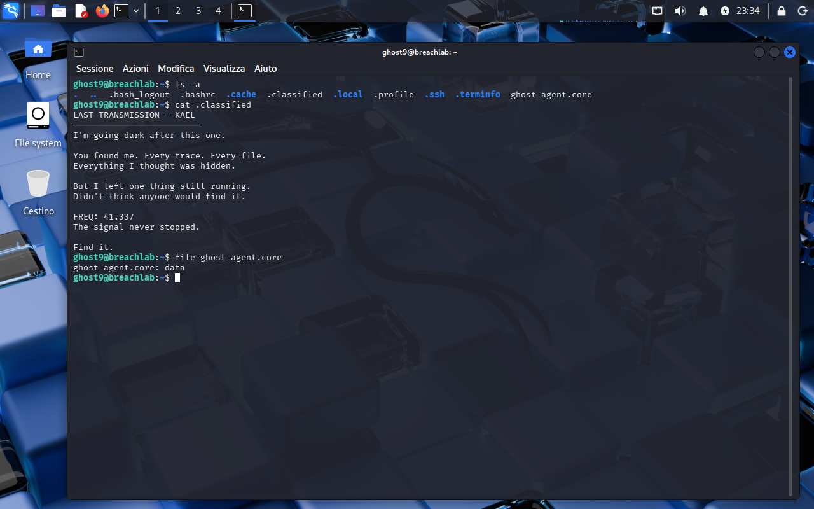
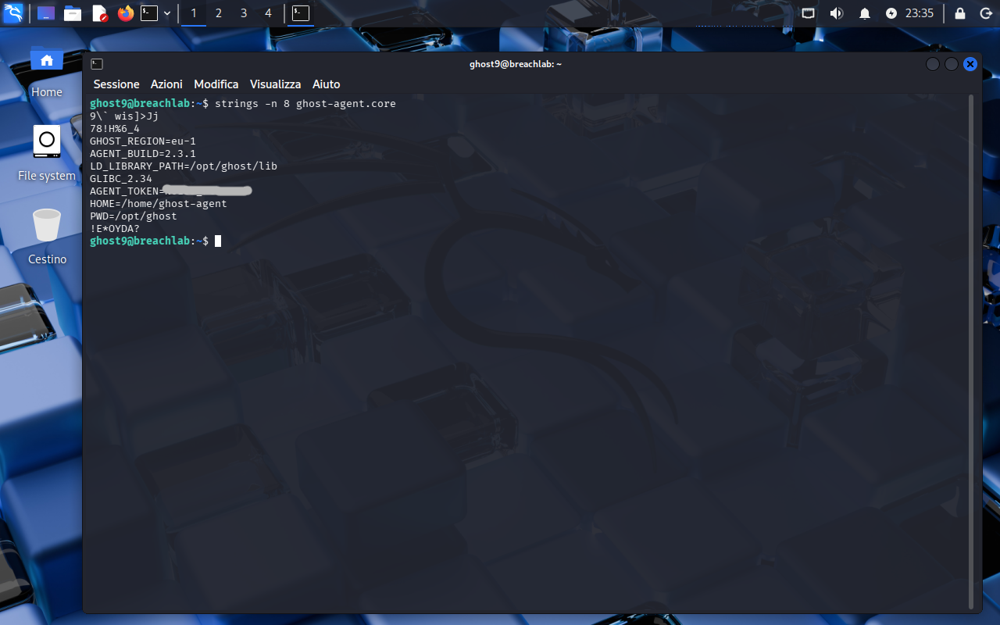

<!-- portfolio-desc: A crashed agent's environment, still sitting in its core dump -->

# Ghost Level 9 - Core Dump

## Objective

> KAEL's last note says one thing of his is still running, and a core file from a crashed agent is sitting in the home directory. The goal: get the credential out of the wreckage and pull the password for `ghost10`.

---

## Access

| Field | Value |
|---|---|
| Method | `ssh` |
| Host | `204.168.229.209:2222` |
| User | `ghost9` |

```bash
ssh ghost9@204.168.229.209 -p 2222
```

---

## Tools / concepts

- `file`: identifies a blob, or admits it cannot
- `strings -n 8`: pulls printable runs out of binary, with a length floor to keep the output readable
- core dumps: a snapshot of process memory, environment included

---

## Solution

### Step 1: Read the note, then look at what it left behind

`ls -a` turns up two things worth opening: a hidden `.classified` and `ghost-agent.core`.

```
LAST TRANSMISSION — KAEL
─────────────────────────

I'm going dark after this one.

You found me. Every trace. Every file.
Everything I thought was hidden.

But I left one thing still running.
Didn't think anyone would find it.

FREQ: 41.337
The signal never stopped.

Find it.
```

`FREQ: 41.337` reads as port 41337, which was among the ports that came back open during the Level 5 sweep. That thread never had to be pulled, though, because the other file answers the question on its own.

`file ghost-agent.core` returns `data`, meaning nothing matched a known signature. That is a description, not a dead end: the file is a core dump, and a core dump is process memory written to disk.



### Step 2: Read the memory as text

A process keeps its environment in memory, so a dump of that memory keeps it too. `strings` pulls out every printable run, and the `-n 8` floor drops the short accidental sequences that would otherwise bury the output:

```bash
strings -n 8 ghost-agent.core
```

What survives is recognisably an environment block, sitting between two stretches of binary noise:

```
GHOST_REGION=eu-1
AGENT_BUILD=2.3.1
LD_LIBRARY_PATH=/opt/ghost/lib
AGENT_TOKEN=[REDACTED]
HOME=/home/ghost-agent
PWD=/opt/ghost
```



### Step 3: Flag found

The password for `ghost10` is the value of `AGENT_TOKEN`, recovered from `~/ghost-agent.core`.

---

## Notes

Same class of secret as Level 8, different medium. There the environment came from `/proc` because the process was alive; here it comes off disk because the process died and left its memory behind. A crash dump is a credential store nobody intended to create, which is most of the argument for turning core dumps off on anything that handles secrets.

`file` reporting `data` is worth not over-reading. It means no magic bytes matched, not that the contents are unreadable, and `strings` does not care about formats at all.
